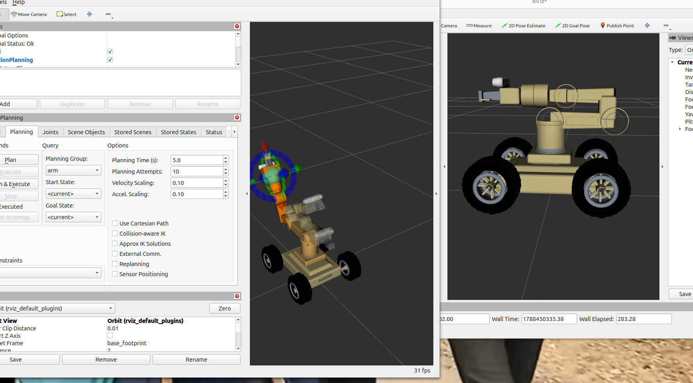

# FLEX-MAN — ROS 2 Mobile Manipulation Platform

> A modular ROS 2 mobile manipulation project focused on autonomous robotic manipulation, perception and navigation for future industrial applications.

---

## Preview

  

---

## About the Project

**FLEX-MAN** is an ongoing ROS 2 mobile manipulation project combining a mobile robotic platform, robotic arm, perception sensors and motion-planning capabilities.

The project is being developed incrementally, with each subsystem validated before full system integration.

> **Note:** Detailed robot architecture, mechanical design, control topology and implementation details are intentionally not disclosed in this public repository.

---

## Current Progress

| Area | Status |
|---|---|
| Robot simulation | ✅ Functional |
| ROS 2 integration | ✅ Functional |
| Sensor integration | ✅ Functional |
| ros2_control integration | ✅ Functional |
| Mobile base control | ✅ Functional |
| 6-DOF arm control | ✅ Functional |
| MoveIt 2 planning | ✅ Functional |
| Motion execution in simulation | ✅ Functional |
| Gripper integration | 🚧 In progress |
| Perception pipeline | 🔜 Planned |
| Autonomous navigation | 🔜 Planned |
| Pick-and-place workflow | 🔜 Planned |

---

## Current Milestone

### MoveIt 2 Manipulation Integration ✅

The current development milestone enables the robotic arm to:

- receive manipulation targets;
- generate motion plans;
- validate trajectories;
- execute planned arm motions in simulation;
- provide joint-state feedback during execution.

This milestone establishes the manipulation foundation required for future perception-driven pick-and-place tasks.

---

## Technology Stack

- **ROS 2 Jazzy**
- **Ubuntu 24.04**
- **Gazebo Harmonic**
- **MoveIt 2**
- **ros2_control**
- **RViz 2**
- **RGB-D sensing**
- **2D LiDAR**
- **IMU**
- **Python / C++**
- **URDF / Xacro**

---

## Development Roadmap

### Completed
- ✅ Robot simulation
- ✅ Sensor integration
- ✅ Mobile-base control
- ✅ Arm control
- ✅ MoveIt 2 integration
- ✅ Motion planning and execution

### In Progress
- 🚧 Gripper control
- 🚧 Manipulation refinement

### Planned
- 🔜 RGB-D perception
- 🔜 Object detection and pose estimation
- 🔜 Autonomous navigation
- 🔜 Pick-and-place
- 🔜 Coordinated mobile manipulation

---

## Target Direction

The long-term goal is to progressively evolve FLEX-MAN toward an autonomous mobile manipulation platform capable of combining:

**Navigation · Perception · Manipulation · Task Execution**

for future industrial and research-oriented robotic applications.

---

## Public Repository Scope

This repository is currently used to document the development progress of FLEX-MAN.

Only selected project information and public demonstrations are shared here. Detailed source code, robot architecture, mechanical design and internal implementation remain private during the active development phase.

---

## Author

**Imen Mabrouk**

Robotics / Industrial Computer Science Engineer

Focus areas:

**ROS 2 · Mobile Robotics · Manipulation · Autonomous Navigation · Sensor Fusion · Robot Perception**

---

## License

Apache-2.0